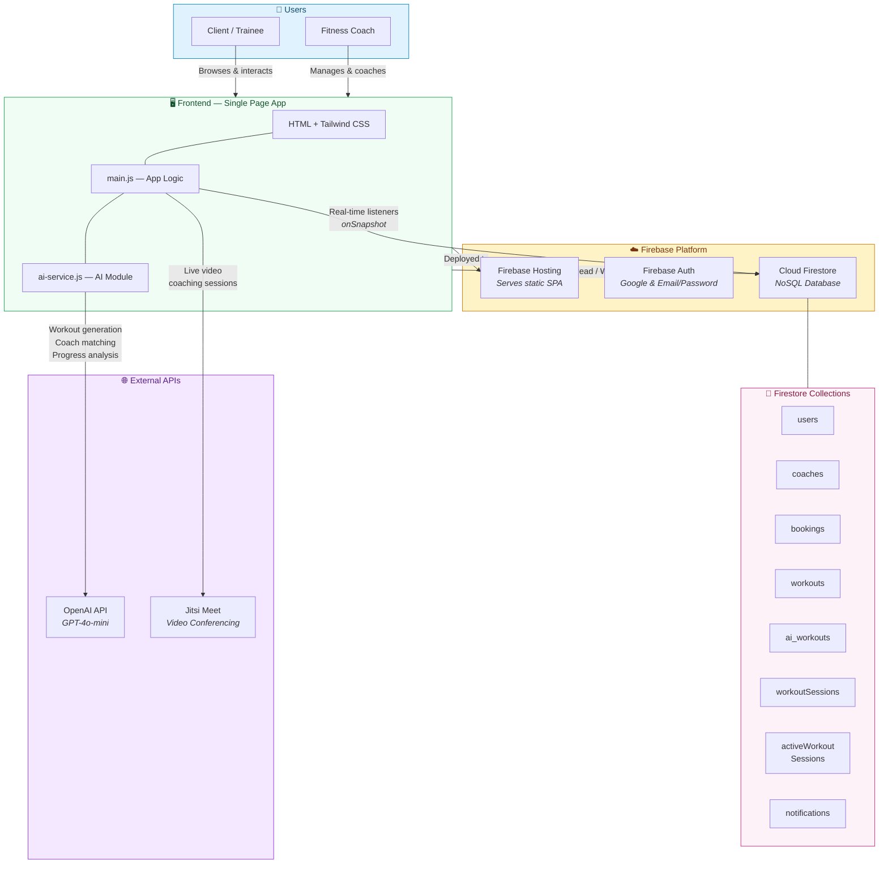

# FindMyFitCoach — High Level Architecture

```mermaid
graph TB
    subgraph Users["👤 Users"]
        Client["Client / Trainee"]
        Coach["Fitness Coach"]
    end

    subgraph Frontend["🖥️ Frontend — Single Page App"]
        direction TB
        UI["HTML + Tailwind CSS"]
        MainJS["main.js — App Logic"]
        AISvc["ai-service.js — AI Module"]
        UI --- MainJS
        MainJS --- AISvc
    end

    subgraph FirebaseServices["☁️ Firebase Platform"]
        direction TB
        Hosting["Firebase Hosting<br/><i>Serves static SPA</i>"]
        Auth["Firebase Auth<br/><i>Google & Email/Password</i>"]
        Firestore["Cloud Firestore<br/><i>NoSQL Database</i>"]
    end

    subgraph FirestoreCollections["📂 Firestore Collections"]
        direction LR
        UsersCol["users"]
        CoachesCol["coaches"]
        BookingsCol["bookings"]
        WorkoutsCol["workouts"]
        AIWorkoutsCol["ai_workouts"]
        SessionsCol["workoutSessions"]
        ActiveSessions["activeWorkout<br/>Sessions"]
        Notifications["notifications"]
    end

    subgraph ExternalAPIs["🌐 External APIs"]
        OpenAI["OpenAI API<br/><i>GPT-4o-mini</i>"]
        Jitsi["Jitsi Meet<br/><i>Video Conferencing</i>"]
    end

    Client -->|"Browses & interacts"| Frontend
    Coach -->|"Manages & coaches"| Frontend

    Frontend -->|"Deployed to"| Hosting
    Frontend -->|"Sign in / Sign up"| Auth
    Frontend -->|"Read / Write data"| Firestore
    Firestore --- FirestoreCollections

    AISvc -->|"Workout generation<br/>Coach matching<br/>Progress analysis"| OpenAI
    MainJS -->|"Live video<br/>coaching sessions"| Jitsi
    MainJS -->|"Real-time listeners<br/><i>onSnapshot</i>"| Firestore

    style Users fill:#e0f2fe,stroke:#0284c7,color:#0c4a6e
    style Frontend fill:#f0fdf4,stroke:#16a34a,color:#14532d
    style FirebaseServices fill:#fef3c7,stroke:#d97706,color:#78350f
    style FirestoreCollections fill:#fdf2f8,stroke:#db2777,color:#831843
    style ExternalAPIs fill:#f3e8ff,stroke:#9333ea,color:#581c87
```