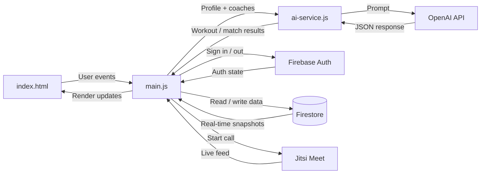

# FindMyFitCoach — Component Interaction

```mermaid
flowchart LR
    UI["index.html"]
    MainJS["main.js"]
    AISvc["ai-service.js"]
    Auth["Firebase Auth"]
    DB[("Firestore")]
    AI["OpenAI API"]
    Video["Jitsi Meet"]

    UI -->|"User events"| MainJS
    MainJS -->|"Render updates"| UI

    MainJS -->|"Sign in / out"| Auth
    Auth -->|"Auth state"| MainJS

    MainJS -->|"Read / write data"| DB
    DB -->|"Real-time snapshots"| MainJS

    MainJS -->|"Profile + coaches"| AISvc
    AISvc -->|"Workout / match results"| MainJS

    AISvc -->|"Prompt"| AI
    AI -->|"JSON response"| AISvc

    MainJS -->|"Start call"| Video
    Video -->|"Live feed"| MainJS
```
