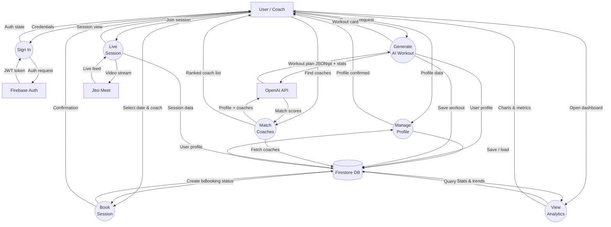

# FindMyFitCoach — Data Flow & Component Interaction

## 1. Data Flow Diagram

```mermaid
flowchart TD
    User["User / Coach"]

    SignIn(("Sign In"))
    ManageProfile(("Manage\nProfile"))
    GenerateWorkout(("Generate\nAI Workout"))
    MatchCoaches(("Match\nCoaches"))
    BookSession(("Book\nSession"))
    LiveSession(("Live\nSession"))
    ViewAnalytics(("View\nAnalytics"))

    FirebaseAuth["Firebase Auth"]
    Firestore[("Firestore DB")]
    OpenAI["OpenAI API"]
    Jitsi["Jitsi Meet"]

    User -->|"Credentials"| SignIn
    SignIn -->|"Auth request"| FirebaseAuth
    FirebaseAuth -->|"JWT token"| SignIn
    SignIn -->|"Auth state"| User

    User -->|"Profile data"| ManageProfile
    ManageProfile -->|"Save / load"| Firestore
    Firestore -->|"User profile"| ManageProfile
    ManageProfile -->|"Profile confirmed"| User

    User -->|"Generate request"| GenerateWorkout
    GenerateWorkout -->|"User profile"| Firestore
    GenerateWorkout -->|"Prompt + stats"| OpenAI
    OpenAI -->|"Workout plan JSON"| GenerateWorkout
    GenerateWorkout -->|"Save workout"| Firestore
    GenerateWorkout -->|"Workout card"| User

    User -->|"Find coaches"| MatchCoaches
    MatchCoaches -->|"Fetch coaches"| Firestore
    MatchCoaches -->|"Profile + coaches"| OpenAI
    OpenAI -->|"Match scores"| MatchCoaches
    MatchCoaches -->|"Ranked coach list"| User

    User -->|"Select date & coach"| BookSession
    BookSession -->|"Create booking"| Firestore
    Firestore -->|"Booking status"| BookSession
    BookSession -->|"Confirmation"| User

    User -->|"Join session"| LiveSession
    LiveSession -->|"Session data"| Firestore
    LiveSession -->|"Video stream"| Jitsi
    Jitsi -->|"Live feed"| LiveSession
    LiveSession -->|"Session view"| User

    User -->|"Open dashboard"| ViewAnalytics
    ViewAnalytics -->|"Query metrics"| Firestore
    Firestore -->|"Stats & trends"| ViewAnalytics
    ViewAnalytics -->|"Charts & metrics"| User
```